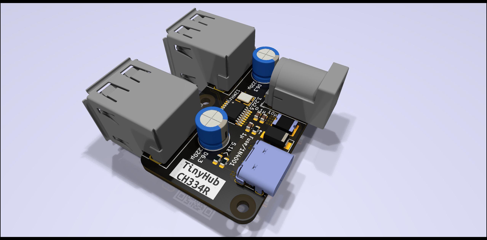
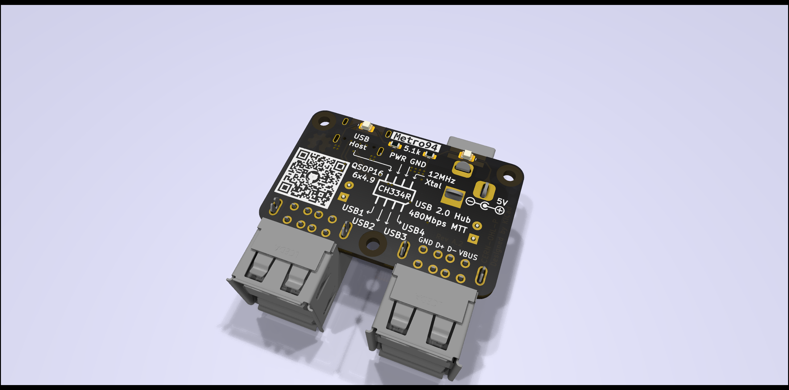

# TinyHub - 4-Port USB Hub with Multi-TT

## Introduction

A tiny USB hub with support of Multi-TT (Transaction Translator), powered by CH334R.

## 3D Rendering View

## License

[CERN-OHL-P](LICENSE)

## EDA

KiCad 6.0.6

## Usages

This PCB can be used with CH334R.

`Fuse/1N4004` selection is depended on CH334 version:

* For the first version of CH334 with 0 in the penultimate 5 digits of the lot number, this device is changed to 1N4001 or similar diode.
* Otherwise, this device should be a 100mA fuse resistor, or for simplified applications, 0Ω can be used.

NOTE: For the first version of CH334R, it could be lack of Multi-TT support, and tools such as USBTreeView would report that hub is Single-TT. For my test, CH334R with the lot number `31160HC16` is **NOT** Multi-TT supported, and `31161HC43` is. I suggest to contact Qinheng for more information.

### Schematics

[TinyHub Schematic](schematics/TinyHub.pdf)

### BOM

[TinyHub BOM](https://metro94.github.io/TinyHub/bom.html)

### Product Page

[USB HUB Controller – CH334/5 - NanjingQinhengMicroelectronics](http://www.wch-ic.com/products/CH334.html)
